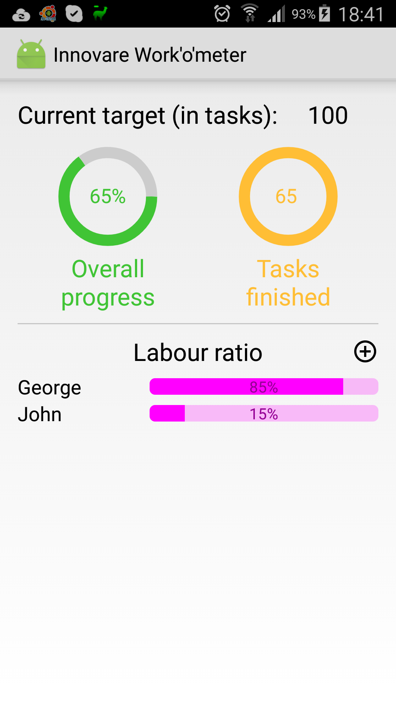

# Innovare Work'o'meter

This is just an example Android project. The functionality is only basic.

It keeps list of people with number of tasks they have finished. It compares their workload and shows overall completition of current master task. Master task has specified number of subtasks, that needs to be finished. The functionality is still not finished. Work in progress.

Currently, the app interface looks like this:

